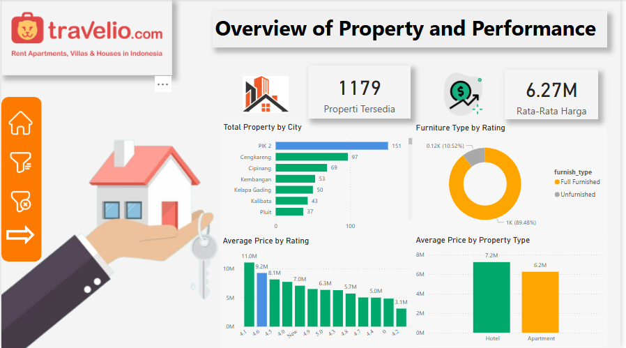

# 📊 Unveiling Market Insights: BI Implementation on Travelio Properties

Proyek ini merupakan proyek kelompok. Implementasi yang saya lakukan meliputi:
- ETL dengan octoparse dan pandas
- Membuat Dashboard dengan Power BI

## 🧠 Ringkasan Proyek

Proyek ini mengeksplorasi penerapan *Business Intelligence (BI)* pada platform properti *Travelio* untuk mengungkap wawasan pasar, meningkatkan efisiensi operasional, dan mendukung pengambilan keputusan berbasis data. Melalui proses ETL, pemodelan multidimensi, dan visualisasi dengan Power BI, sistem BI dirancang untuk menyederhanakan analisis performa properti secara real-time.

## 🎯 Tujuan

- Extract, Transform dan Load data dari Website travelio
- Mengembangkan dashboard interaktif berbasis Power BI.
- Mengidentifikasi faktor-faktor yang memengaruhi rating dan okupansi properti.

## ⚙️ Teknologi

- **Python** – ETL (`Pandas`, `Pyscopg2)
- **PostgreSQL** – Data warehouse dengan star schema
- **Power BI** – Visualisasi data
- **Octoparse** – Scraping 

## 📊 Fitur Dashboard

- Distribusi harga berdasarkan lokasi & tipe properti
- Hubungan antara diskon dan rating pengguna
- Filter interaktif (rating, kapasitas, furnitur)
- Peta persebaran properti (geospatial visual)

## 💡 Insight

* Fokus Ekspansi Geografis:

- Saat Ini: Konsentrasi properti tinggi di PIK 2.
- Rekomendasi: Prioritaskan akuisisi properti di area potensial lain seperti Cengkareng atau Cipulir untuk diversifikasi dan pertumbuhan pasar.

* Genjot Kualitas Properti:

- Saat Ini: Rating lebih tinggi berkorelasi dengan harga lebih baik.
- Rekomendasi: Lakukan program peningkatan kualitas bagi properti ber-rating rendah untuk meningkatkan nilai dan daya saing.
